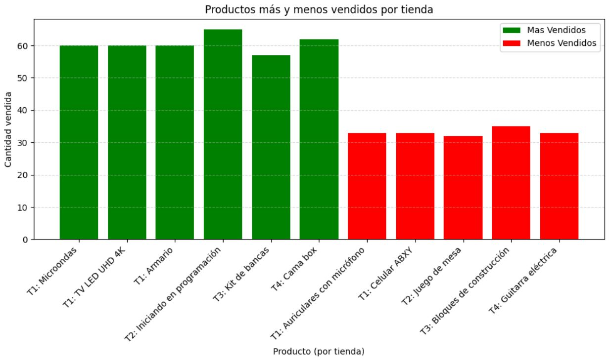

# Proyecto de analisis de datos STORE (Challenge)
El proposito de este Challenge es implementar los conocimientos adquiridos hasta ahora en un proyecto real, como se fuera un proyecto para una empresa en donde se esta contratado, se haran actividades como las de un equipo de proyecto, como por ejemplo, se usaran herramientas como **trello** para dar un seguimiento en el proyecto y así tambien como **github**.

## Estructura del proyecto
La estructura del proyecto se divide en tres fases:
- Primeros pasos
    - Acerca del desafio
    - Crear repositorio GitHub
    - Extraccion de datos
    - Conozca el conjunto de datos
- Análisis de datos
    - Ingreso total por cada tienda
    - Ventas por categoría
    - Valoración media por tienda
    - Productos más vendidos y menos vendidos
    - Valor de envío promedio por tienda
- Visualización
    - Generador gráfico
    - Informe final
- Extra
    - Extra, Analisis de desempeño geografico
- Entrega del desafio
    - ReadMe
    - Entrega del desafio

## Ejemplos de gráficos e insights obtenidos.
Los ejemplos se crearon con pyplot de la libreria matplotlib, entre ellos bar, barh, pie y plot

## Instrucciones para ejecutar el notebook.
Para ejecutar el notebook, lo puedes hacer de una forma sencilla, lo puedes subir a colab y este tiene un servidor que tiene todo instalado por ti, asi que si lo haces de esta forma no te preocuparas por instalar cosas como python o inclusive algunas librerias pip en tu computadora, pero, yo lo hice de otra forma, trabaje este proyecto en visual studio por que me acomodo más.

Primero tienes que instalar python y ejecutarlo en visual studio, el IDE practicamente te guia para que puedas ejecutar python y la otra cosa que tienes que instalar es jupyter para que puedas usar los notebook (ipynb) esto es demasiado facil, solo busca la extension **"Jupyter"** y en la consola que tienes por defecto en python tienes que instalar las herramientas necesarias de pip como por ejemplo **"matplotlib", "numpy", "pandas"** y una ultima cosa, tienes que asegurarte que la ruta de los csv este bien vinculada a los dataframes ya que son los datos con los que que trabaje.